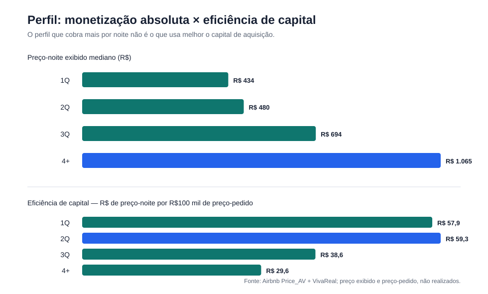
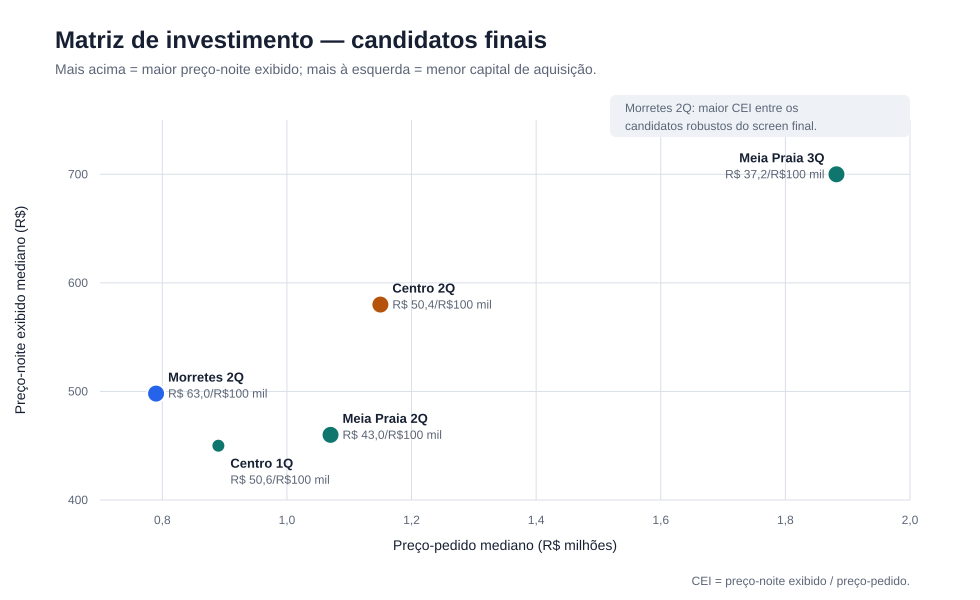
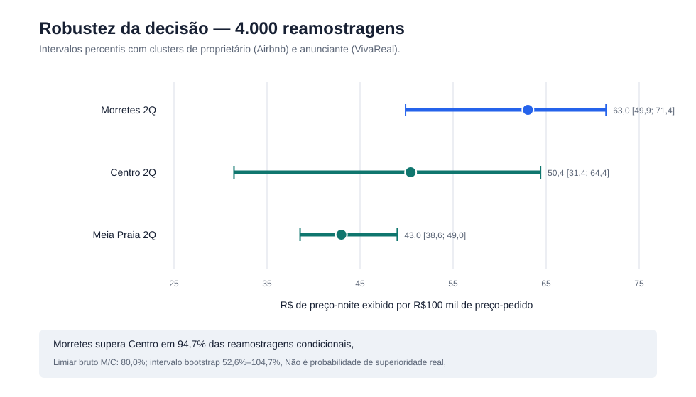
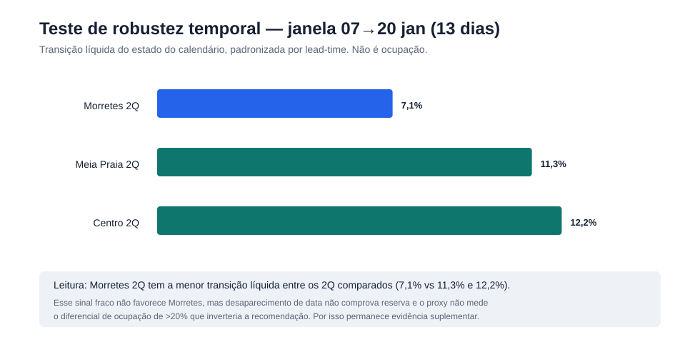

🎥 **Vídeo (até 3 min):** [COLE_AQUI_O_LINK_PUBLICO_DO_GOOGLE_DRIVE]


# Hackathon Jovens Talentos AI Builder 2026 — Seazone
## Recomendação de investimento imobiliário em Itapema (SC)

## Decisão em uma frase

> **Eu priorizaria um apartamento de 2 quartos em Morretes para a diligência de aquisição.** É o segmento robusto com melhor eficiência de capital no recorte observado. Minha alternativa é **Centro 2Q**. A recomendação tem **confiança moderada** e muda se Morretes operar com ocupação mais de **20% inferior** à do Centro.

A base não observa ocupação nem receita realizada. Por isso, separo claramente três coisas: **preço-noite exibido**, **preço-pedido de aquisição** e **cenários hipotéticos de ocupação**. A recomendação combina esses elementos sem tratá-los como retorno realizado.

Em **4.000 reamostragens clusterizadas**, Morretes 2Q fica em primeiro em **69,8%** das vezes entre os cinco candidatos finais e supera a alternativa Centro 2Q em **94,7%** das comparações pareadas. Isso mede estabilidade condicional à amostra — **não é probabilidade de superioridade real** — e não resolve ocupação ausente nem a cobertura seletiva do preço.

## Respostas do desafio — resumo executivo

| Pergunta | Resposta direta |
|---|---|
| **1. Melhor perfil de imóvel** | No universo comparável de **apartamentos**, eu escolheria **2 quartos para investimento**. Imóveis 4+ quartos têm o maior preço-noite absoluto, mas 1–2Q são mais eficientes por capital e 2Q lidera o CEI entre os grupos comparáveis. |
| **2. Melhor localização em receita** | A base **não mede receita realizada**. Usando o preço-noite exibido como proxy operacional, **Meia Praia lidera no agregado robusto**, com mediana de R$600/noite. Ao controlar o número de quartos, **Centro** lidera nos recortes de 2Q e 3Q. |
| **3. Características associadas a maior preço-noite** | Mais **quartos**, **banheiros** e operação **profissional** aparecem associados a preços-noite maiores no modelo. A especificação estrutural explica ~33% da variação e a completa ~40%. |
| **4. O que comprar hoje** | **Morretes 2Q**. Alternativa: **Centro 2Q**. Confiança moderada. A decisão se inverte se Morretes operar >20% abaixo do Centro em ocupação relativa. |
| **Tese studio + Centro** | **Inconclusiva** por falta de observações comparáveis. |
| **Tese 1Q + Centro** | **Parcialmente sustentada**, mas não supera Morretes 2Q na comparação final de investimento. |

## Por onde começar

| Se você quer… | Abra |
|---|---|
| A análise completa | [`relatorio.md`](relatorio.md) |
| O índice de evidências e correções de IA | [`ai-log/README.md`](ai-log/README.md) |
| Prompts e respostas da sessão de IA | [`ai-log/01_ai_log.md`](ai-log/01_ai_log.md) |
| Setup e método de trabalho com IA | [`ai-log/02_setup_metodo.md`](ai-log/02_setup_metodo.md) |
| Configuração versionada dos agentes | [`.agents/`](.agents/) |
| Reproduzir a análise | [`analysis/README.md`](analysis/README.md) |
| Buy box reproduzível de Morretes 2Q | [`analysis/buy_box_morretes_2q.csv`](analysis/buy_box_morretes_2q.csv) |
| Roteiro de gravação do vídeo | [`roteiro-video.md`](roteiro-video.md) |
| Visualizações | [`figures/`](figures/) |
| Dados originais | [`data/`](data/) |

---

# 1. Qual o melhor perfil de imóvel?

> **RESPOSTA DIRETA:** para investimento, eu escolheria **apartamentos de 2 quartos**. Se o objetivo fosse apenas maximizar o preço-noite absoluto, o vencedor seria **4+ quartos**.

Para manter comparabilidade entre Airbnb e VivaReal, a análise de investimento foi restrita a **apartamentos**. Dentro desse universo:



| Perfil | Preço-noite exibido mediano | Preço-pedido mediano | CEI |
|---|---:|---:|---:|
| 1Q | R$434 | R$750 mil | 0,000578 |
| **2Q** | R$480 | R$810 mil | **0,000593** |
| 3Q | R$694 | R$1,80 mi | 0,000385 |
| 4+ | **R$1.065** | R$3,60 mi | 0,000296 |

O custo de aquisição cresce mais rápido que o preço-noite nos imóveis maiores. Assim, **maior monetização absoluta e maior eficiência de capital levam a respostas diferentes**.

`CEI = preço-noite exibido mediano / preço-pedido mediano`.

---

# 2. Qual a melhor localização em receita?

> **RESPOSTA DIRETA:** a base não permite medir receita realizada. Usando **preço-noite exibido mediano** como proxy operacional, **Meia Praia** lidera no agregado entre bairros com amostra robusta. Ao comparar imóveis do mesmo número de quartos, **Centro** lidera nos recortes de 2Q e 3Q.

Entre bairros com pelo menos 30 anúncios precificados:

| Bairro | n | Preço-noite exibido mediano |
|---|---:|---:|
| **Meia Praia** | **607** | **R$600** |
| Centro | 193 | R$587 |
| Morretes | 68 | R$500 |

Tabuleiro apresenta R$610, mas com n=17 e permanece exploratório.

A comparação agregada mistura tipologias diferentes. Dentro de **2Q**: Centro = **R$580**, Morretes = R$498 e Meia Praia = R$460. Dentro de **3Q**: Centro = **R$790** e Meia Praia = R$700.

Portanto, **Meia Praia responde à comparação agregada**, enquanto o controle por quartos mostra que parte da diferença entre bairros vem da composição dos imóveis observados.

---

# 3. Quais características estão associadas a maior preço-noite?

> **RESPOSTA DIRETA:** no modelo, preços-noite maiores aparecem associados principalmente a **mais quartos**, **mais banheiros** e **operação profissional**. A diferença entre bairros diminui quando a comparação controla as demais características observadas.

Foi estimado um modelo OLS associativo sobre `log(preço-noite exibido mediano)` com **911 anúncios**, erros clusterizados por proprietário e Meia Praia como referência de bairro.

| Variável | Associação aproximada |
|---|---:|
| +1 quarto | **+19,0%** |
| +1 banheiro | **+15,0%** |
| +1 hóspede | +3,0% |
| operador profissional | **+22,9%** |
| superhost | −2,6%, n.s. |
| instant book | +2,0%, n.s. |
| log(reviews+1) | −8,4% |
| Centro vs Meia Praia | +5,6%, n.s. |

A especificação estrutural explica cerca de **33%** da variação; com variáveis operacionais e de host, cerca de **40%**.

Esses resultados são **associativos, não causais**. Em particular, “operador profissional” pode refletir seleção e diferenças não observadas entre os anúncios.

---

# 4. O que eu compraria hoje?

> **RESPOSTA DIRETA:** **Morretes 2Q** é minha recomendação primária. **Centro 2Q** é a alternativa. A confiança é **moderada**.



| Segmento | Tier | Noite | Preço-pedido | Viva n | CEI | CE90 |
|---|---|---:|---:|---:|---:|---:|
| **Morretes 2Q** | **A** | **R$498** | **R$790 mil** | **1.035** | **0,000630** | **3,12%** |
| Centro 1Q | B | R$450 | R$890 mil | 21 | 0,000506 | 2,50% |
| Centro 2Q | A | R$580 | R$1,15 mi | 87 | 0,000504 | 2,50% |
| Meia Praia 2Q | A | R$460 | R$1,07 mi | 241 | 0,000430 | 2,13% |
| Meia Praia 3Q | A | R$700 | R$1,882 mi | 1.658 | 0,000372 | 1,84% |

**Por que Morretes 2Q:** combina evidência Tier A, preço-pedido mediano menor e o maior CEI entre os candidatos robustos avaliados.

**Tier é uma classificação de robustez da amostra:** A exige pelo menos 30 observações em cada lado da comparação; B, pelo menos 15; abaixo disso o segmento é exploratório.

`CE90 = preço-noite exibido × 90 × ocupação hipotética de 55% / preço-pedido`. É um **cenário mecânico de eficiência**, não ROI observado.

## Robustez estatística do ranking

O teste principal usa **4.000 reamostragens** e preserva a concentração dos dados: os clusters são **proprietários** no Airbnb e **anunciantes** no VivaReal. O resultado não transforma preço exibido em receita e não preenche a ocupação que a base não contém.



| Segmento | Clusters Air/Viva | CEI pontual | Intervalo bootstrap 95% |
|---|---:|---:|---:|
| **Morretes 2Q** | 40 / 121 | **0,000630** | **0,000499–0,000714** |
| Centro 1Q | 20 / 16 | 0,000506 | 0,000442–0,000750 |
| Centro 2Q | 41 / 42 | 0,000504 | 0,000314–0,000644 |
| Meia Praia 2Q | 163 / 68 | 0,000430 | 0,000386–0,000490 |
| Meia Praia 3Q | 275 / 192 | 0,000372 | 0,000342–0,000381 |

Morretes 2Q ocupa o primeiro lugar em **69,8%** das reamostragens entre os cinco finalistas e supera Centro 2Q em **94,7%** das reamostragens pareadas. Essas proporções são **estabilidade sob reamostragem, não probabilidade de o bairro ser realmente superior**. Viés de seleção, sazonalidade, ocupação e diferenças físicas entre imóveis ficam fora do bootstrap.

### Sensibilidade a anúncios repetidos e concentração

Uma deduplicação de estresse por assinatura econômica reduz o VivaReal de Morretes 2Q de 1.035 para 873 linhas, mas altera sua mediana de preço-pedido em apenas **−0,1%** (R$790 mil → R$789 mil). No Centro 2Q, a mediana muda **+6,7%** (R$1,15 mi → R$1,227 mi). Morretes continua líder. Quando cada proprietário e anunciante recebe peso igual, o CEI é **0,000612** em Morretes e **0,000389** no Centro.

A seleção de preço ainda importa: o `Price_AV` cobre **22,3%** dos apartamentos Morretes 2Q, contra 35,5% no Centro 2Q e 25,9% em Meia Praia 2Q. O bootstrap não corrige essa cobertura seletiva; por isso a confiança permanece moderada.

## Teste de robustez da principal incerteza

A variável capaz de inverter Morretes × Centro é a **ocupação relativa**. Como `Price_AV` contém três capturas do calendário, testei se as mudanças de estado das datas traziam algum sinal útil antes de fechar a recomendação.

O teste compara anúncios presentes em ambas as capturas, restringe o horizonte de estadia comum e padroniza a transição líquida por faixas de antecedência (`0–14`, `15–30`, `31–60`, `61–90` dias). Para não tratar janelas sobrepostas como evidências independentes, a visualização usa o par **07→20 de janeiro (13 dias)**.



| Segmento 2Q | Transição líquida padronizada 07→20 jan |
|---|---:|
| Morretes 2Q | **7,1%** |
| Meia Praia 2Q | 11,3% |
| Centro 2Q | 12,2% |

**O sinal temporal é desfavorável a Morretes:** entre os segmentos 2Q comparados, Morretes apresenta a menor transição líquida do calendário. Esse resultado é incorporado à avaliação de risco e ajuda a justificar a confiança apenas **moderada**.

Ao mesmo tempo, o indicador **não mede ocupação**. O arquivo não possui flag de reserva; uma data pode desaparecer ou reaparecer por motivos diferentes de uma reserva concluída. Portanto, 7,1%, 11,3% e 12,2% são medidas de movimento do calendário, não taxas de ocupação.

### Condição que muda minha decisão

> **Se Morretes operar com ocupação mais de 20% inferior à do Centro, eu mudo para Centro 2Q.**

O ponto estimado exige que Morretes alcance **80,0%** da ocupação do Centro. No bootstrap, porém, esse limiar varia de **52,6% a 104,7%**; a incerteza amostral inclui cenários em que Morretes precisaria igualar ou superar o Centro. O teste temporal fornece evidência suplementar, mas não verifica esse limiar. Antes de comprometer capital, eu validaria a ocupação realizada por bairro e tipologia.

## Cenário líquido mecânico — não é previsão

Para comparar a decisão após custos, apliquei a mesma premissa de **55% de ocupação** e **30% de custos operacionais variáveis**. Condomínio e IPTU são medianas entre valores plausíveis observados no VivaReal: R$80–R$5.000/mês para condomínio e R$100–R$30.000/ano para IPTU. A cobertura é incompleta. O resultado é antes de financiamento e imposto de renda.

| Segmento | Bruto mecânico/ano | Condomínio + IPTU | Líquido mecânico | Yield líquido sobre preço-pedido |
|---|---:|---:|---:|---:|
| **Morretes 2Q** | R$100,0 mil | R$5,0 mil | **R$65,0 mil** | **8,23%** |
| Centro 2Q | R$116,4 mil | R$7,0 mil | R$74,5 mil | 6,48% |
| Meia Praia 2Q | R$92,3 mil | R$7,0 mil | R$57,7 mil | 5,39% |

Esse cenário líquido mecânico **não é previsão** nem retorno observado. Na grade completa reproduzível (ocupação de 40%/55%/70% e custo variável de 20%/30%/40%), a fronteira permanece próxima do limiar bruto: se o Centro operar a 55%, Morretes empata perto de **44,2%** sob a premissa de custo variável de 30%.

## Buy box de diligência — captura histórica

A [buy box completa](analysis/buy_box_morretes_2q.csv) transforma o segmento vencedor em leads verificáveis. O filtro exige preço-pedido até o P25 (**R$680 mil**), área entre P25 e P75 (**65–70 m²**), preço/m² até a mediana (**R$11.551/m²**), ao menos uma vaga e condomínio/IPTU nas faixas plausíveis declaradas. Após diversificar títulos e assinaturas econômicas repetidas, restam 32 elegíveis; o arquivo publica 12. Preços ou preços/m² abaixo do P5 recebem um alerta explícito para validação.

| Lead da base | Pedido | Área | R$/m² | Condomínio | IPTU/ano |
|---|---:|---:|---:|---:|---:|
| [2666436700](https://www.vivareal.com.br/imovel/apartamento-2-quartos-morretes-bairros-itapema-com-garagem-69m2-venda-RS374000-id-2666436700/) | R$374 mil | 69 m² | R$5.420 | R$290 | R$490 |
| [2646969738](https://www.vivareal.com.br/imovel/apartamento-2-quartos-morretes-bairros-itapema-com-garagem-70m2-venda-RS450000-id-2646969738/) | R$450 mil | 70 m² | R$6.429 | R$250 | R$100 |
| [2688799819](https://www.vivareal.com.br/imovel/apartamento-2-quartos-morretes-bairros-itapema-com-garagem-66m2-venda-RS515000-id-2688799819/) | R$515 mil | 66 m² | R$7.803 | R$300 | R$500 |
| [2694368874](https://www.vivareal.com.br/imovel/apartamento-2-quartos-morretes-bairros-itapema-com-garagem-70m2-venda-RS520001-id-2694368874/) | R$520 mil | 70 m² | R$7.429 | R$300 | R$1.000 |
| [2768930018](https://www.vivareal.com.br/imovel/apartamento-2-quartos-morretes-bairros-itapema-com-garagem-70m2-venda-RS530000-id-2768930018/) | R$530 mil | 70 m² | R$7.571 | R$275 | R$480 |

Isso é um **screen histórico, não recomendação de compra**. Links e atributos são da base de janeiro de 2025; disponibilidade, endereço, documentação, estado, custos e preço atual precisam ser verificados.

---

# Posição sobre a tese de compactos no Centro

### Studio + Centro

> **RESPOSTA:** **inconclusivo**.

Não há observações comparáveis suficientes para validar ou rejeitar essa parte da tese. Não extrapolei o resultado de 1Q para studio.

### 1Q + Centro

> **RESPOSTA:** **parcialmente sustentado**.

É um segmento eficiente e testável, mas o lado de aquisição é fino (21 ofertas válidas) e fica abaixo de Morretes 2Q na comparação final.

**Minha conclusão sobre a tese:** compactos apresentam boa eficiência, mas os dados não sustentam “Centro + studio/1Q” como regra geral de compra. Studio não pode ser validado e, entre os segmentos testáveis, minha escolha permanece Morretes 2Q.

---

# Limitações e diligência antes de capital

As limitações que mais afetam a decisão são:

1. **ocupação realizada não observada** — é a variável que pode inverter Morretes × Centro;
2. **cobertura seletiva de preço** — apenas 999 dos 4.441 anúncios aparecem no `Price_AV`; em Morretes 2Q, a cobertura é 22,3%;
3. **janela Jan–Abr/2025** — não mede sazonalidade anual;
4. **preço-pedido ≠ preço de transação**;
5. **Airbnb e VivaReal não têm correspondência física de imóvel** — as comparações são por segmento.

Antes de comprar, eu priorizaria: ocupação interna da Seazone por bairro × quartos; preço efetivo de transação; custos de condomínio, IPTU, gestão, plataforma e manutenção; e uma janela anual de preço e ocupação.

---

# Como trabalhei com IA

Usei o **Antigravity** para estruturar papéis, skills, handoffs e checkpoints, e o **Claude Code** para implementar, executar e revisar a análise. O método está documentado em [`ai-log/02_setup_metodo.md`](ai-log/02_setup_metodo.md) e em [`.agents/`](.agents/).

A IA foi usada em ciclos separados de execução e revisão. Alguns exemplos que alteraram materialmente a análise:

- a regra de Tier estava especificada com `AND`, mas uma etapa do código usava `OR`; a revisão identificou e corrigiu a implementação;
- o proxy temporal foi reconstruído por antecedência e rebaixado de possível sinal de reservas para **evidência suplementar de estado de calendário**;
- a interpretação dos coeficientes log-lineares foi corrigida para `100 × (exp(β) − 1)` e a referência de bairro foi substituída por uma comparação mais útil;
- o primeiro `Consistency Gate` não fazia verificações efetivas; ele foi substituído por **14 verificações programáticas** antes do fechamento.
- a auditoria pós-entrega adicionou bootstrap por clusters, deduplicação de estresse, cenários líquidos e buy box; o gate passou a ter **20 verificações**.

A sequência principal de prompts e respostas está em [`ai-log/01_ai_log.md`](ai-log/01_ai_log.md); o mapa das intervenções e artefatos está em [`ai-log/README.md`](ai-log/README.md).

---

# Como reproduzir

Requisitos: Python 3.11+.

```bash
python -m venv .venv
# Windows: .venv\Scripts\activate
# Linux/macOS: source .venv/bin/activate
pip install -r requirements.txt
python analysis/run_final_analysis.py
python analysis/temporal_proxy.py
python analysis/decision_robustness.py
python analysis/generate_figures.py
python scripts/consistency_gate_final.py
```

A mesma sequência é executada no GitHub Actions. Os scripts geram os resultados principais, os testes temporal/estatístico, a buy box e as quatro visualizações diretamente a partir dos cinco CSVs oficiais.

Detalhes: [`analysis/README.md`](analysis/README.md).

---

# Conclusão

> **Eu colocaria Morretes 2Q no topo da diligência e Centro 2Q como alternativa. O líder fica em primeiro em 69,8% das reamostragens dos cinco finalistas e vence Centro 2Q em 94,7% das comparações pareadas, mas isso não é probabilidade de superioridade real. Como a cobertura de preço é seletiva e o sinal temporal é desfavorável, a compra permanece condicionada à validação da ocupação, dos custos e dos 12 leads da buy box.**
